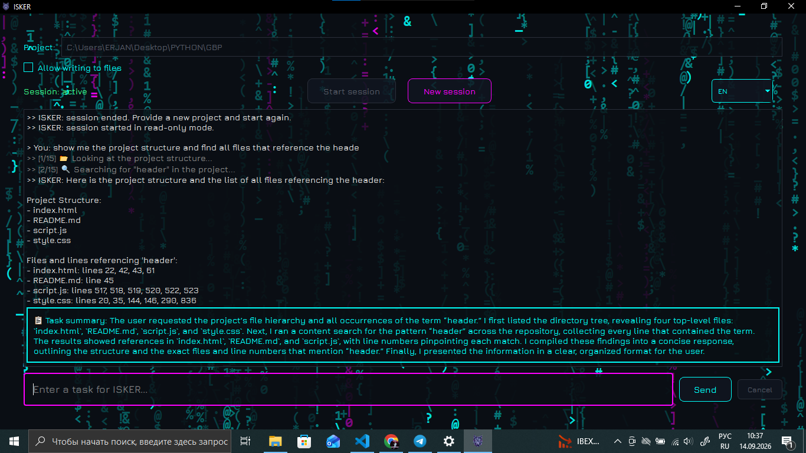

# ISKER — AI-агент для рутинной разработки

Языко-агностичный AI-агент, который берёт на себя рутину в кодинге:
написание функций по описанию, поиск и переименование по всему проекту,
рефакторинг, исправление багов по описанию/логу, генерацию тестов и
документации.

Работает **одинаково** с любым текстовым файлом — GDScript (Godot),
Python, HTML/CSS/JS и т.д. Специфика языка задаётся на уровне промпта, а
не на уровне кода инструментов, так что переход на новый стек не требует
переделки самого агента.

Работает на **бесплатных лимитах** через цепочку из трёх провайдеров
(Groq → OpenRouter → Gemini) с автоматическим переключением и повторными
попытками при перегрузке.

> Это pet-проект для портфолио, при этом реально рабочий инструмент,
> которым автор пользуется в собственных проектах. Он **не заменяет**
> понимание кода разработчиком — всё, что требует творческого решения
> (архитектура, визуальная работа, выбор ассетов), человек делает сам.

---

## Скриншот



---

## Возможности

- **Desktop-интерфейс** на PySide6 — окно чата, история диалога,
  индикатор прогресса шагов (`[3/15]`), кнопка отмены задачи.
- **Готовый `.exe` для Windows** — можно скачать и запустить без
  установки Python (см. раздел "Быстрый старт").
- **Три языка интерфейса**: русский, английский, испанский —
  переключаются на лету, без перезапуска. Агент отвечает на том языке,
  на котором задан вопрос, независимо от языка интерфейса.
- **Резюме задачи** после каждого выполнения — что именно было сделано
  и почему, отдельным блоком в чате.
- **Цепочка провайдеров с fallback и ретраями**: если один провайдер
  недоступен — агент автоматически переключается на следующий; если
  недоступны все три сразу — ждёт и повторяет попытку (5, затем 15
  секунд), прежде чем сообщить об ошибке.
- **Кэширование** повторяющихся запросов в рамках сессии.
- **Кнопка отмены**: можно прервать длительную задачу между шагами —
  без отката уже применённых изменений, с честным отчётом о том, что
  успело выполниться.
- **CLI-режим** (`main.py`) — для тестирования ядра из терминала, без
  графического интерфейса.

---

## Быстрый старт (без установки Python)

1. Перейди в раздел [Releases](../../releases) этого репозитория.
2. Скачай архив `ISKER-windows.zip` из последнего релиза.
3. Распакуй архив **целиком** в любую папку.
4. Заполни файл `.env` внутри распакованной папки по образцу
   `.env.example` — впиши хотя бы один бесплатный API-ключ (см. раздел
   "Получение API-ключей" ниже).
5. Запусти `ISKER.exe`.

> **Важно:** `.exe` не работает сам по себе — рядом с ним обязательно
> должна лежать папка `_internal` (там все нужные библиотеки). Если
> хочешь вынести программу в другое место (например, на рабочий стол):
> либо скопируй **всю папку целиком** (`ISKER.exe` + `_internal`),
> либо оставь папку на месте и сделай **ярлык** от `ISKER.exe`
> (правой кнопкой → "Отправить" → "Рабочий стол, создать ярлык") —
> так проще при будущих обновлениях.
>
> При первом запуске Windows SmartScreen может показать предупреждение
> "Windows защитила ваш компьютер" — это стандартная реакция на `.exe`
> от независимого разработчика без платной цифровой подписи, не
> сигнал о вирусе. Нажми "Подробнее" → "Выполнить в любом случае".

---

## Установка из исходников (для разработчиков)

```bash
git clone <ссылка-на-этот-репозиторий>
cd isker
python -m venv venv
source venv/bin/activate    # Windows: venv\Scripts\activate
pip install -r requirements.txt
cp .env.example .env
```

Впиши в `.env` хотя бы один API-ключ (раздел ниже).

### Получение API-ключей (все три — бесплатно)

- **Groq**: https://console.groq.com/keys
- **OpenRouter**: https://openrouter.ai/keys
- **Gemini**: https://aistudio.google.com/apikey

Ключ не обязателен от всех трёх провайдеров сразу — агент работает и
с одним, просто без fallback на случай перегрузки этого провайдера.

### ⚠️ Названия моделей в `.env.example` могут устареть

Провайдеры периодически снимают старые версии моделей с поддержки.
Если в логах видишь `LLM FAIL ... reason=HTTP 404` для какого-то
провайдера — значит, модель, прописанная в `.env`, больше не
существует. Агент автоматически переключится на следующего провайдера
по цепочке, но для полноценной работы стоит обновить `.env` актуальным
именем модели. Актуальные списки моделей:

- Groq: https://console.groq.com/docs/models
- OpenRouter (фильтр `:free`): https://openrouter.ai/models
- Gemini: https://ai.google.dev/gemini-api/docs/models

### Запуск GUI-версии

```bash
python -m ui.app
```

### Запуск CLI-версии (для тестов в терминале)

```bash
python main.py
```

### Сборка собственного `.exe`

```bash
pyinstaller --name ISKER --windowed --add-data "assets;assets" --hidden-import ui.app --icon assets/icon.ico run_gui.py
```

Готовый `.exe` появится в `dist/ISKER/` вместе с папкой `_internal` —
переносить нужно обе части вместе (см. предупреждение выше).

---

## Перед началом работы с агентом

**Обязательно сделай `git commit`** (или сохрани копию проекта вручную)
перед тем, как разрешать агенту запись в файлы. Приложение само
напомнит об этом при старте сессии с включённой записью, но
ответственность за сохранение — на человеке: агент не выполняет
git-команды сам.

При старте сессии:
1. Укажи путь к корню проекта.
2. Разреши запись в файлы (или оставь только чтение — по умолчанию).
3. Ставь задачи в свободной форме, например: "найди все места, где
   используется health, и покажи их" или "исправь баг: NullReferenceException
   в PlayerController.gd на строке 42".

Атомарность: если агент прервётся посреди многошаговой правки
(ошибка, ручная отмена) — уже применённые изменения **не откатываются
автоматически**, только показывается честный список того, что успело
примениться. Откат — через сохранённую точку `git commit`.

---

## Тесты

```bash
pytest
```

---

## Структура проекта

```
agent/       # ядро: LLM-обёртка с fallback/ретраями, цикл агента, память
tools/       # универсальные инструменты работы с файлами (языко-агностичные)
ui/          # десктоп-интерфейс на PySide6
assets/      # шрифт, иконка
tests/       # pytest
main.py      # CLI-точка входа
run_gui.py   # точка входа для сборки GUI в .exe
```

---

## Известные ограничения

Это pet-проект на бесплатных лимитах, а не коммерческий продукт —
ограничения ниже не баги, а сознательные архитектурные решения:

- **Бесплатные лимиты провайдеров** конечны. Если все три провайдера
  перегружены одновременно — агент подождёт и повторит попытку дважды
  (до ~20 секунд), но если и это не поможет — сообщит об ошибке,
  предложив попробовать позже.
- **Нет отката отдельных файлов** посреди многошаговой правки —
  только откат всей сессии целиком через `git`, который делает сам
  пользователь.
- **Не читает скриншоты/изображения** — бесплатные модели в текущей
  цепочке провайдеров недостаточно хорошо поддерживают это.
- **Не парсит сайты массово** — сознательно, из-за антибот-защиты и
  нестабильности при изменении вёрстки. Может прочитать содержимое
  одной страницы по явно заданной ссылке.
- Визуальную и творческую работу (расстановка сцен, выбор ассетов,
  архитектурные решения) агент не делает — это остаётся за
  разработчиком.

---

## Лицензия

MIT
